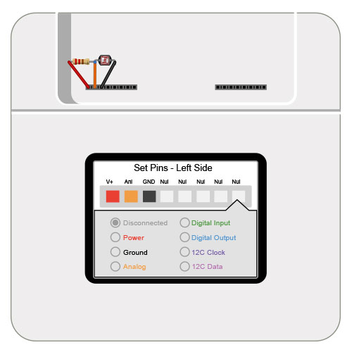

#Analog Value Graph

Plots the reading from any [analog sensor](../analog/) in realtime.

See a video demonstration of this project [here](https://youtu.be/wRKk2DnCel0).

<!--
<iframe width="640" height="360" src="https://www.youtube.com/embed/wRKk2DnCel0?rel=0&amp;controls=1&amp;showinfo=0&autoplay=0" frameborder="0" allowfullscreen></iframe>
-->

##Components

* [Mini Photo cell](https://www.sparkfun.com/products/9088)
* [10k resistor](https://www.sparkfun.com/products/8374)

##Notes

Just like “Analog Skeleton”, this sample can be used with arbitrary analog sensors. Here we’re showing a photo resistor, but you could also use potentiometers, accelerometers, or many others. Different sensors will need slightly different setups. For instance, this photo cell needs a pull-up resistor, but many analog sensors do not. Just make sure that your circuit matches the pin mux and code. This sample also contains an easy to use canvas graph abstraction for plotting the data.

##Setup

You can mux the pins using the Front Pins app prior to running the project, but it's not necessary to do so as the application code does it for you. Figure 2 shows how to mux the pins using the Front Pins app.

**Figure 1.** If you choose not to mux the pins using the Front Pins app, a confirmation dialog box will pop up on the screen of your Kinoma Create to confirm the muxing when you run the project. 


**Figure 2.** Set pin 51 to Power, 52 to Analog, and 53 to Ground. Then wire photoresistor and 10k resistor as shown.



##Code Highlights

There are two files used in this application.

1. `main.js`, the application file
2. `plotter.js`, a module that contains all the logic related to the `Canvas` object that plots the data from the analog sensor

###Plotter

The exported `Plotter` object in `plotter.js` is a `Canvas` object. You can read the full details on `Canvas` objects in the [KinomaJS JavaScript reference](http://kinoma.com/develop/documentation/javascript/), but all you really need to know is that `Canvas` objects let you draw using the HTML 2D Canvas API specified by the W3C. 

```
let Plotter = exports.Plotter = Canvas.template($ => ({ 
	left: 0, right: 0, top: 0, bottom: 0, 
	skin: new Skin({ fill: 'white',}), 
	behavior: PlotterBehavior
}));
```

The `Plotter` object's behavior contains a `gotReading` function that interprets the sensor's data and adds to the on-screen line graph.

###Application

The `onLaunch` function of the application's behavior is where we put together the UI and configure the pins. You can adjust settings, including the colors of the graph, by editing the `plotterParams` object.

```
let plotterParams = {
	name: "sensor1",		
	interval: 10,
	buckets:200,
	background: "white",
	strokeStyle: "red",
	lineWidth: 4,
	complement: true
};
```

As with all KinomaJS projects, we use the [Pins module](http://kinoma.com/develop/documentation//create-pins-module/) to interact with the sensor. The call to `Pins.configure` specifies that we want to use `Analog.js`, the [built-in analog BLL](https://github.com/Kinoma/kinomajs/blob/master/kinoma/kpr/projects/create/shell/device/Analog.js) and the pins it uses.

```
Pins.configure({
	potentiometer: {
    	require: "Analog",
        pins: {
        	power: { pin: 51, type: "Power", voltage: 3.3 },
        	analog: { pin: 52 },
        	ground: { pin: 53, type: "Ground" }
        }
    }
}, ...
```

The `Plotter` object takes readings from the sensor at the interval specified in `plotterParams` and distributes the data to all `content` objects in the containment hierarchy of the application. You can read more about the `distribute` function and `Behavior` objects in our [Application Logic in Behaviors tutorial](http://kinoma.com/develop/documentation/kinomajs-tutorials/behaviors/).

```
Pins.invoke("/potentiometer/read", data => {
	application.distribute("gotReading", data);
});
```

##Download

You can download the analog-graph project [here](https://github.com/Kinoma/KPR-examples/tree/master/analog-graph) or in the Samples tab of Kinoma Code.
